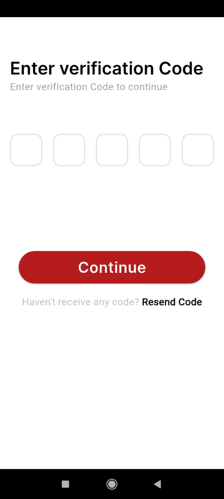

# RiStream

## 🖼 App Screenshots

### 🔹 Row 1

  
  
  
  

### 🔹 Row 2

  
  
  
 

 
  
  
  
  

### 🔹 Row 2

  
  
  
  

### 🔹 Row 1

  
  
  
  

### 🔹 Row 2

  
  
  
 

  
  
  
  

### 🔹 Row 2

  
  
  
  

### 🔹 Row 2

  
  
  
 

  
  
  
  

### 🔹 Row 2

  
  
  
  

### 🔹 Row 2

  
  
  
 

//=========================================================
### 🔹 Row 2

  
  
  
 

